学生优惠白嫖阿里云的2h2g的ECS发现阿里云公共镜像没有Arch Linux

加上镜像市场的Arch居然要15块钱一个月，一年就是**180**！！！
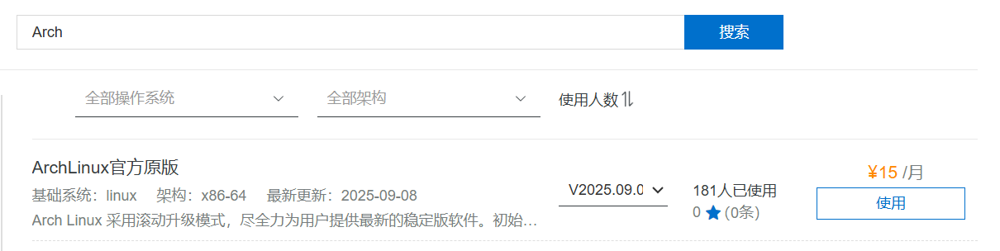
所以我打算自己利用ISO安装，搜索发现网上很多文章都是很多年前。（我的系统环境：Ubuntu 24.04 64位）


## 1. 备份！备份！备份！

## 2. [下载ISO](https://archlinux.org/download/)
由于写文章的时候阿里云ISO下载受限，所以换了其他源，平常时候建议用阿里云的源下载ISO。

```bash
wget https://mirrors.hust.edu.cn/archlinux/iso/2026.03.01/archlinux-2026.03.01-x86_64.iso https://mirrors.hust.edu.cn/archlinux/iso/2026.03.01/b2sums.txt

# 验证iso，显示archlinux-2026.03.01-x86_64.iso: OK即可
b2sum -c b2sums.txt
```
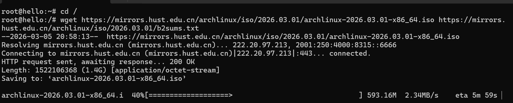

## 3. 添加grub引导
运行df命令可以查看，系统安装在`/dev/vda3`，对应GRUB中的`(hd0,3)`
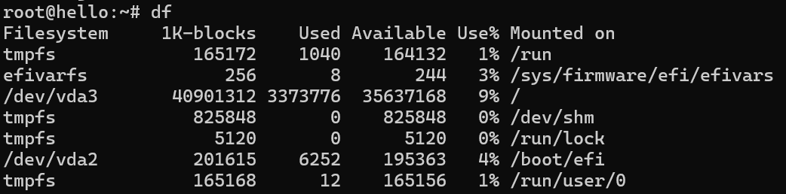

添加grub引导
```bash
cat << 'EOF' >> /etc/grub.d/40_custom
menuentry "ArchLinux" {
    set root=(hd0,3)
    set imgdevpath="/dev/vda3"
    set isofile="/archlinux-2026.03.01-x86_64.iso"
    loopback loop $isofile
    echo "Starting from dev=$imgdevpath iso=$isofile..."
    linux (loop)/arch/boot/x86_64/vmlinuz-linux img_dev=$imgdevpath img_loop=$isofile copytoram=y archisobasedir=arch
    initrd (loop)/arch/boot/x86_64/initramfs-linux.img
}
EOF

# 检查是否正确添加
cat /etc/grub.d/40_custom

# 更新grub引导
update-grub
```

## 3. 安装Arch

### 进入live环境
前往阿里云的VNC远程连接,运行`reboot`有画面之后按`ESC`，选择ArchLinux，按Enter

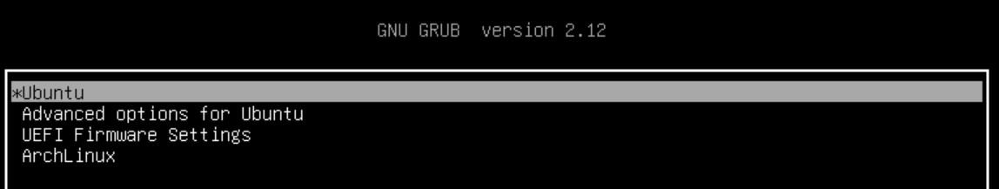

这之后ISO会自动安装，直到显示密钥对之后再按下Enter，进入live环境

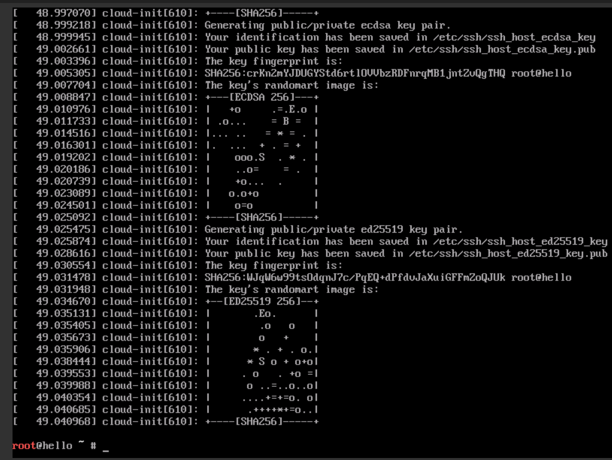

### `fdisk -l`检查分区
发现阿里云原本已经分配好了，所以只需要格式化一下分区就行
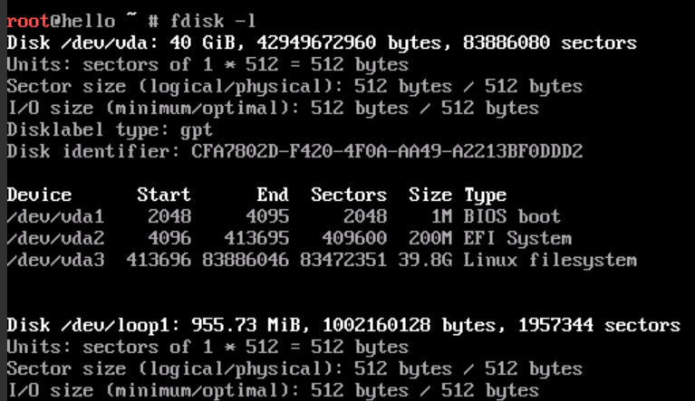

```bash
# 格式化根分区
mkfs.ext4 /dev/vda3

# 格式化EFI系统分区
mkfs.fat -F 32 /dev/vda2 
```

### 挂载分区（不要多次运行这个命令！！！）
```bash
mount /dev/vda3 /mnt
mount --mkdir /dev/vda2 /mnt/boot
```

### 确认网络情况
```bash
ping mirrors.cloud.aliyuncs.com 

# 如果ping的通的话，写入阿里的镜像站
echo 'Server = http://mirrors.cloud.aliyuncs.com/archlinux/$repo/os/$arch' > /etc/pacman.d/mirrorlist

pacman -Sy pacman-mirrorlist
```

### 安装基础软件
```bash
# Linux 内核和常见硬件固件的基本安装
pacstrap -K /mnt base linux linux-firmware 

# 后继grub引导和vim安装，方便等下写入引导
pacstrap /mnt grub efibootmgr vim 
```

### 生成`fstab`文件
```bash
genfstab -U /mnt > /mnt/etc/fstab

# 最好确认一下是否正常生成
cat /mnt/etc/fstab
```
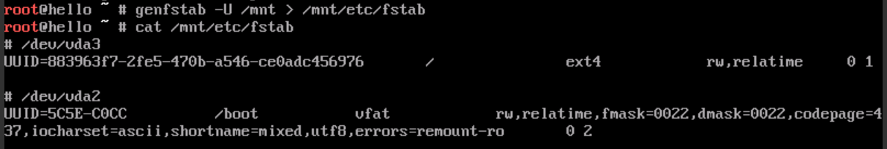

发现刚刚格式化并挂载的分区在里面就行，如果发现有问题可以用`vim`手动修改`/mnt/etc/fstab`。例如，如果前面运行多次的挂载分区的命令会出现重复的情况，则只需要删除重复的即可。

### chroot 到新安装的系统
```bash
arch-chroot /mnt
```


### 设置时间和时区
```bash
ln -sf /usr/share/zoneinfo/Asia/Shanghai /etc/localtime && hwclock --systohc
```

### 区域和本地化设置

用`vim`编辑`/etc/locale.gen`，然后取消掉`en_US.UTF-8 UTF-8`和其他需要的 `UTF-8`区域设置前的注释`#`。

接着执行 `locale-gen` 以生成 `locale` 信息。

然后创建 locale.conf(5) 文件，并编辑设定 LANG 变量。
```bash
echo "LANG=en_US.UTF-8" | tee /etc/locale.conf
```
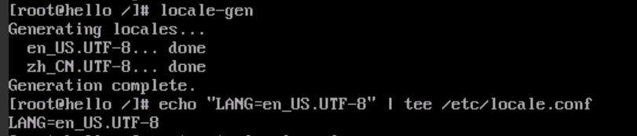

### 网络配置

```bash
# 初始化密钥环
pacman-key --init

# 安装dhcpcd
pacman -S dhcpcd

# 设置enable自启动
systemctl enable dhcpcd.service
```

### 设置`root`密码
```bash
passwd
```
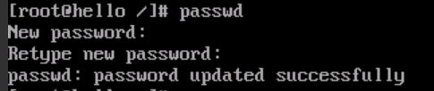

### **安装引导程序GRUB**(关键的一部)

```bash
# 适用于UEFI系统，将GRUB安装到硬盘上
grub-install --target=x86_64-efi --efi-directory=/boot --bootloader-id=GRUB

# 生成主配置文件
grub-mkconfig -o /boot/grub/grub.cfg
```

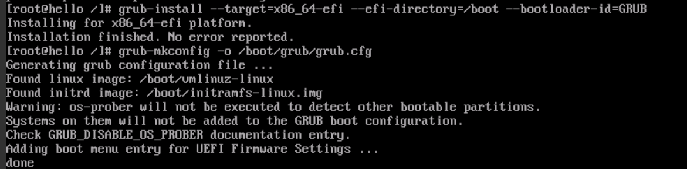

### 安装完成，重启试试
输入 `exit`,可选用`umount -R /mnt`手动卸载被挂载的分区
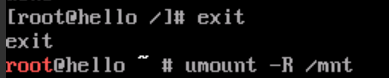

运行`reboot`重启，发现ArchLinux的启动选项
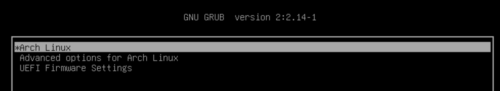

成功进入系统，输入root和刚刚设置的`root`密码，即可进入系统进行后继的配置
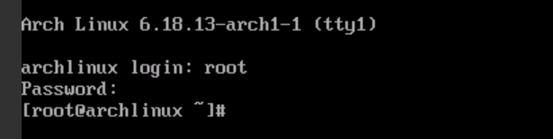

## 参考

1. [阿里云 ESC 安装 ArchLinux](https://brothereye.cn/blog/linux/ali-ecs2arch/)

2. [Arch wiki安装指南](https://wiki.archlinuxcn.org/wiki/)